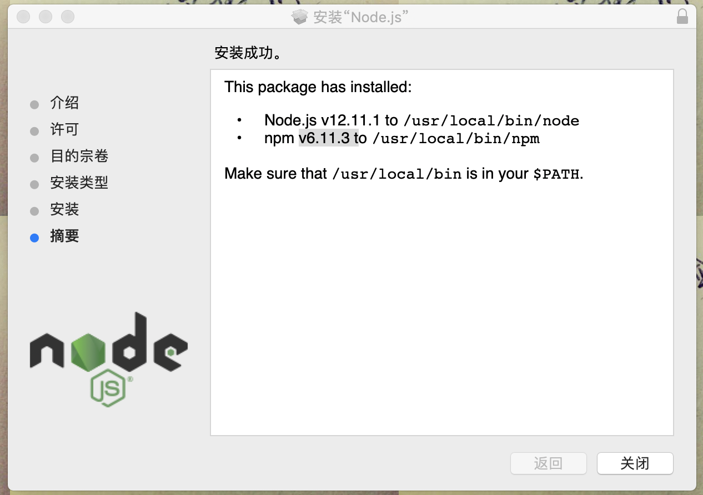
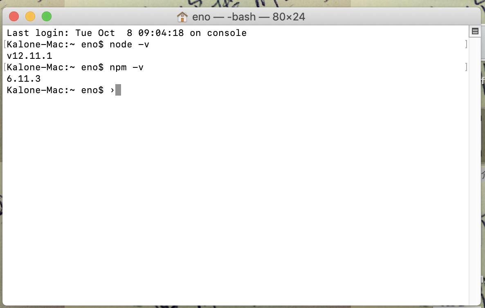

# NodeJS

## 前端

> 前端运行JS的条件

在以前如果你需要运行一份JS，你写完这份`index.js`之后需要一份`index.html`利用`<script>`标签引入，并且在浏览器中打开该页面执行对应的代码

- 必须需要html `<script>`
- 浏览器

> 后端运行JS的条件

我不需要`html`和`css`

- 浏览器的环境

把浏览器运行JS的控制台(Chrome V8 引擎)挖了出来，单独安装到系统上，只给JS服务。从而抛弃`html`和`css`

Node的本质就是Chrome的控制台，只服务JS。JS从前端“退化”进后端，JS想专心去干一件事件，不是为前端服务，就是为了证明自己。


## 下载 && 安装

根据你的电脑系统去下载对应的版本，[官方下载地址](http://nodejs.cn/download/)

检查是否安装成功，如果安装成功在命令行里面可以用以下两个指令查看到版本





# 运行NodeJS的脚本

现在既然引擎已经安装在系统上，那么我们可以利用该系统的命令行唤醒node命令，执行对应的JS脚本。

```bash
node index.js
# 可以省略后缀
node index
```

# 模块化

把一个很复杂的逻辑，分开去写，比如写轮播图的我就用一份`swiper.js`，比如封装DOM的操作`jquery.js`，分模块完成任务，

- 方便维护
- 方便找问题
- 方便团队开发
- 逻辑解耦

Node把html和css抛弃了，`<script>`模块化的方案不适用了

```html
<script src="jquery.js"></script>
<script src="swiper.js"></script>
```

- `<script>`
- require.js AMD规范   require('./xxx') define('xxxx')
- sea.js CMD规范  require()
- comonon.js规范 Node
- ES6 import和export

导入使用`require`关键词
```js
// 导入一个函数
const module2 = require('./module2.js')
const fn = require('./fn.js')
console.log(1)
module2()
console.log(fn.arr)
// 代替script的模块化规范
```

导出用`module.exports`关键词
```js
module.exports = {
    arr: [1, 2, 3],
    bool: !0,
    plus(a, b) {
        return a + b
    }
}
```

---

- 内置模块 (既然它删掉DOM和BOM，内部增加很多原本JS不存在的模块功能，大部分都是操控系统的模块) [官方的内置模块接口文档](http://nodejs.cn/api/)
- 第三方模块 gulp来自于npm jquery来自于npm

- 自定义模块 自己写的功能

## 系统

- android
- ios
- node

## 内置模块(原生模块)

相当于手机的相机，联系人，信息，电话，本身手机自带的功能

- fs 文件模块 file system


## 第三方模块

手机从应用商店[npm](https://www.npmjs.com/)下载的其他功能，微信，支付宝

npm其实就是第三方模块的市场，也就是世界上大部分开源模块的托管平台
```bash
npm install gulp -g
npm install jquery
npm install requirejs
npm install bootstrap
```

## 自定义模块

自己写的功能

# npm

模块市场，里面有全世界基本所有JS模块

```bash
npm install gulp -global
# 卸载
npm uninstall gulp
# 等价的
npm i gulp -g
# 初始化一个package.json，模块的描述文件，可以记录你自定义模块的关键内容
npm init
# 把模块记录到package.json的dependencies字段里面
npm install gulp --save
npm install gulp --s
# 把模块记录到package.json的devDependencies字段里面
npm install gulp --save-dev
npm install gulp --S
# 如果你所在根目录下有一个package.json，你可以使用下面的命令把对应的模块重新安装回来 你可以使用一个npm插件，帮助你在package.json右键直接安装
npm install
# 这个就是可以帮助你运行script里面记录的命令
npm run xxx
```
使用第三方模块
```js
const gulp = require('gulp')
gulp.src
gulp.dest
```

## 文件系统模块

以下就是在node里面引入fs模块的方法
```js
const fs = require('fs')
```

# 同步和异步

JS单进程单线程语言(另类多进程)，由于JS太过高调，PHP和JAVA支持回调写法。

- sync 同步
同步需要等待

- async 异步
异步不需要等待(xmlHttpRequest，定时器)

- 同步一般不需要回调
- 异步要借助回调才有意义
- 一般有回调的函数是异步

# promise，await和async

后期我们会使用这些来解决node的异步问题，回调金字塔，Promise让异步变为我们人的习惯思维，就是同步序列

# gulp原理

- 先使用原生fs模块，它提供读取文件的方法，把代码给读取出来(二进制)，转化为字符串
- 通过正则或者一些原生JS方法，处理对应的字符串
- 最后把结果给写入到新的文件里面
- 由于读和写都是异步方法，所以会出现回调嵌套，可以把回调嵌套放入Promise中配个async和await来实现回调的序列化

```js
const fs = require('fs')
// gulp把你的文件给读出来，然后修改，最后再写回去
// 读取文件
function readFile() {
    return new Promise((resolve, reject) => {
        fs.readFile('./index.js', (err, data) => {
            if (err) throw err;
            // 读出来的是二进制
            // console.log(data.toString());
            let code = data.toString();
            // 正则匹配把所有的console.log
            let output = code
                .replace(/console.log\([a-z0-9'"]+\)/g, '')
                .replace(/const/g, 'var')
            console.log(output)
            // 把结果交给下一个Promise
            resolve(output)
        })
    })
}
function writeFile(output) {
    return new Promise((resolve, reject) => {
        fs.writeFile('./output.js', output, (err) => {
            if (err) throw err;
            console.log('写入成功');
        })
    })
}
;(async () => {
    let output = await readFile()
    await writeFile(output)
})()
```

# 淘宝镜像(拷贝)

如果npm安装不成功，可以尝试使用cnpm安装，保证稳定性，因为cnpm来自于中国的服务器

```bash
npm install -g cnpm --registry=https://registry.npm.taobao.org
```

# 爬虫

分析网页，把网页有用信息提取回来，数据库分析

- 先去网页上获取页面的源代码 request(http)模块
- 再配合jsdom和jquery，模拟DOM和BOM，利用DOM技术提取图片的节点，获取图片地址
- 下载

# 笔记

- https://github.com/Wscats/node-tutorial/issues/2

