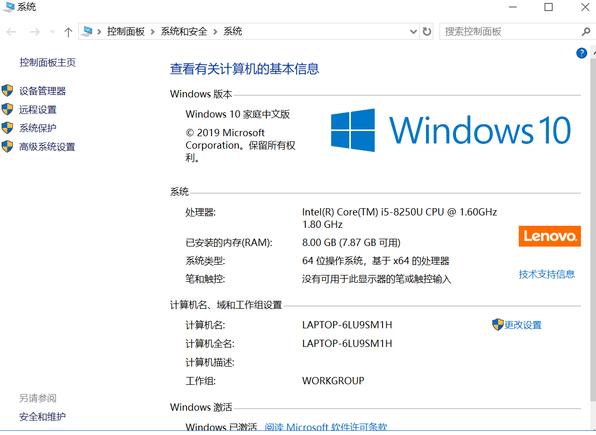
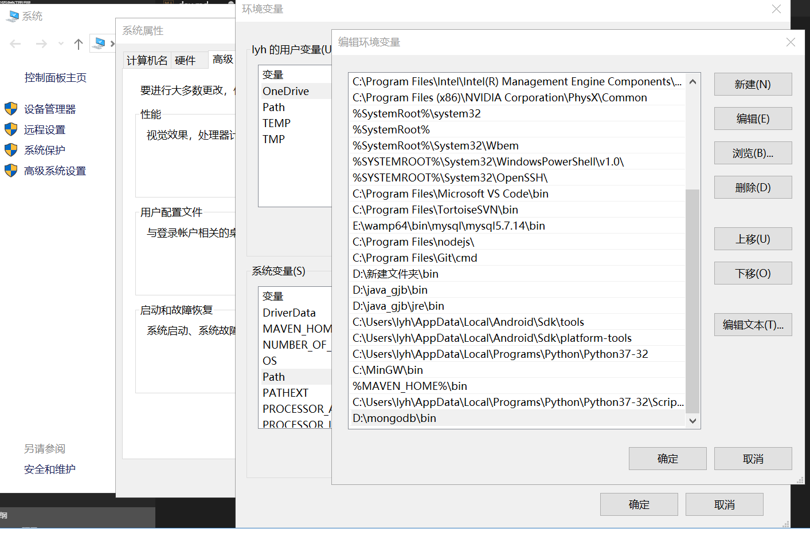
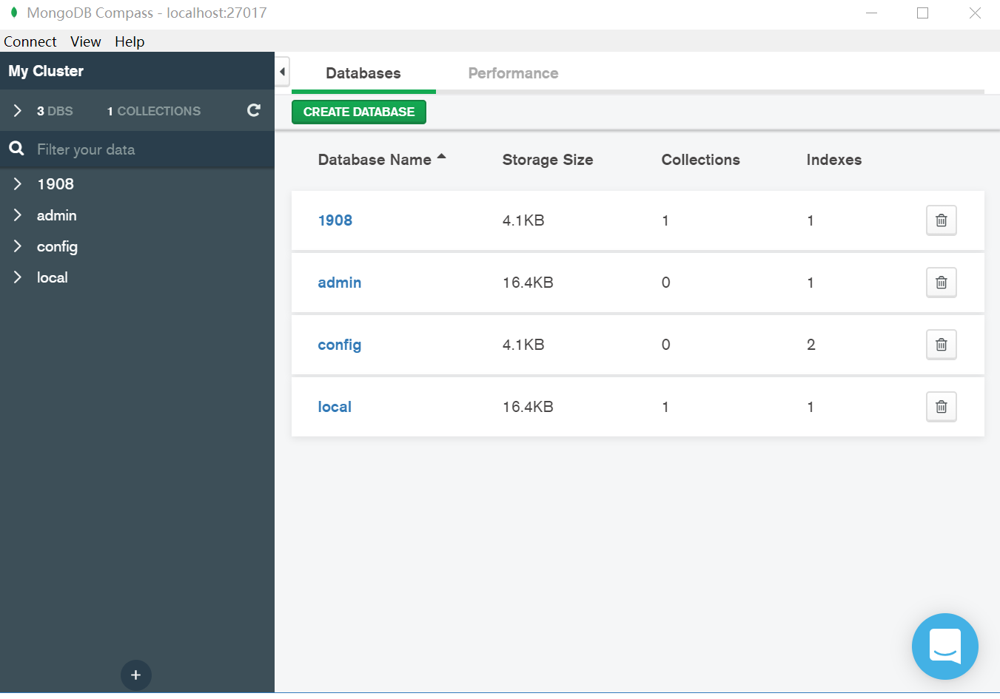
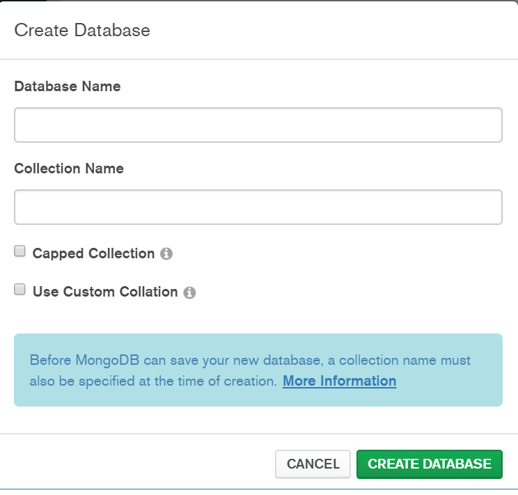
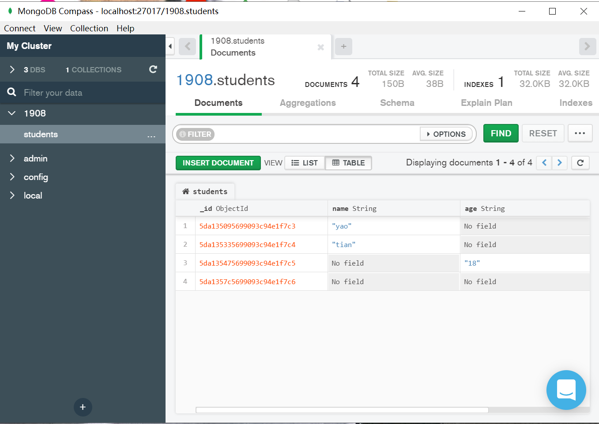

# mongodb

- mongodb.msi
 - bin 里面有命令行 mongod
- compass

先把bin文件夹设置到环境变量里面




当你把bin设置在环境变量里面之后，就会在全局的cmd命令行里面有mongod的命令



有了命令之后，可以使用命令运行或者创建数据库

```bash
mongod --dbpath 路径
```

你可以选择一个文件夹做路径，然后在这个文件夹里面初始化数据库，如果这个文件夹本身就是数据库，那么执行这个命令就是开启这个数据库，命令行在数据库运行过程中是不能关闭的，否则会失去连接

为了你可以不打这么长的命令，你可以用`package.json`来去优化这个指令，`npm init`初始化一份模块描述文件，然后把`script`的命令做以下修改：

```json
{
    "scripts": {
        "start": "mongod --dbpath 路径"
    }
}
```
你就可以在以后，直接`npm start`来代替长指令启动

实现可视化，因为你总不能在命令行频繁操作数据库，因为不直观，所以我们安装`compass`可视化的仪表盘



你可以用最简单的方式，点击按钮更改你的数据库

- database 库
- collection 表(集合)



你可以创建一个1908的库，里面吗包含一张students的表格

你可以在数据库里面产生各种键值对数据，这种数据是可以随机生成的，mysql强类型(设计表结构)，但是mongodb是可以没有任何表结构，它是不需要sql语句去修改数据库(nosql数据库)



调用node来去获取数据库的信息，安装mongodb模块，使用该模块去连接数据库

```bash
npm init
npm install mongodb
```

参考mongodb的[npm文档](https://www.npmjs.com/package/mongodb)

新建一份`app.js`，写入一下代码，使用命令`node db`启动

```js
const MongoClient = require('mongodb').MongoClient;
// 引入node内置的断言模块
const assert = require('assert');
// Connection URL
const url = 'mongodb://localhost:27017';
// Database Name
const dbName = 'myproject';
// Use connect method to connect to the server
MongoClient.connect(url,  { useNewUrlParser: true },function(err, client) {
  // null===err?'抛出错误 断言':'继续往下走'
  // if err throw err
  assert.equal(null, err);
  console.log("Connected successfully to server");
  const db = client.db(dbName);
  client.close();
});
```
- `const db = client.db(dbName);` 选库
- `const collection = db.collection('students');` 选集合(表)
- `collection.insertMany(xxx,()=>{})` 执行增删改查的操作
```js
MongoClient.connect(url, {
        useNewUrlParser: true
    },
    function (err, client) {
        assert.equal(null, err);
        console.log("Connected successfully to server");
        // 获取数据库db对象 必须sql语句
        const db = client.db(dbName);
        // 选中对应的集合
        const collection = db.collection('students');
        // 往集合加入三条数据
        collection.insertMany([{
            a: 1
        }, {
            a: 2
        }, {
            a: 3
        }], function (err, result) {
            assert.equal(err, null);
            assert.equal(3, result.result.n);
            assert.equal(3, result.ops.length);
            console.log("Inserted 3 documents into the collection");
        });
        client.close();
    });
```

- `collection.find({})` 执行查找，如果对象为空，则返回全部，如果是键值对，那就查满足条件的对应那一条

```js
collection.find({
    // 查找a为1的数据
    a: 1
}).toArray(function (err, docs) {
    assert.equal(err, null);
    console.log("Found the following records");
    console.log(docs)
});
```
- `collection.updateOne()` 执行更新操作，更改一个，第一个参数是筛选第二个参数为更改
```js
collection.updateOne({ a : 2 }
    , { $set: { b : 1 } }, function(err, result) {
    assert.equal(err, null);
    assert.equal(1, result.result.n);
    console.log("Updated the document with the field a equal to 2");
  });
```